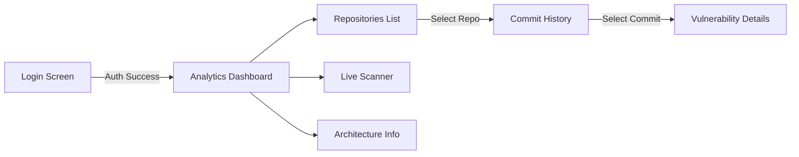

# Frontend Design Document

## 1. User Flow

The Sentinel AI dashboard follows a hierarchical drill-down navigation structure designed for clarity and efficiency.

### Screens:
1.  **Login:** Simulates OAuth entry point.
2.  **Analytics (Home):** High-level metrics for managers and leads.
3.  **Repositories:** List of monitored projects with health status.
4.  **Commit History:** A table view of recent scans for a specific repository.
5.  **Scan Details:** The "Deep Dive" view showing code snippets and specific vulnerabilities identified by Gemini.

## 2. Component Hierarchy

*   `App` (State Container: User, View, Selected Repo)
    *   `Sidebar` (Navigation)
    *   `LoginView`
    *   `DashboardView` (Charts)
    *   `RepositoryView` (List of Cards)
    *   `CommitHistoryView` (Table + Logic for Analysis)
        *   *Uses `geminiService` for on-demand analysis*
    *   `ScannerView` (Manual Playground)

## 3. State Management
We use React Local State (`useState`) instead of Redux for simplicity given the constraints, but the structure mimics a larger app:
*   `user`: Authenticated user context.
*   `currentView`: Acts as the router.
*   `selectedRepoId`: specific ID to drill down into commits.

## 4. Design System
*   **Theme:** "Slate & Emerald" Dark Mode.
*   **Typography:** Inter (UI) + JetBrains Mono (Code).
*   **Icons:** Lucide-React.
*   **Visuals:** Subtle gradients and border-glow effects to imply "AI/Cybersecurity".

## 5. API Integration Strategy (Frontend Side)
*   **Mock Data:** `constants.ts` provides instant data for the UI layout.
*   **Live AI:** `services/geminiService.ts` connects to Google Gemini for *real* analysis of the mock code snippets.
*   **Latency Simulation:** `setTimeout` is used in Login to mimic network requests for realism.
