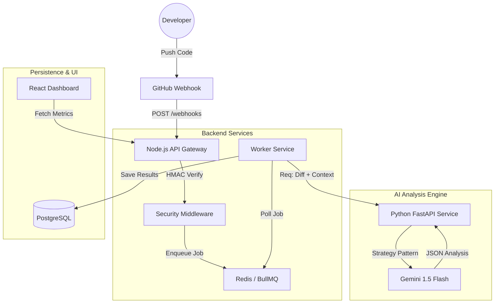

# Sentinel AI: DevSecOps Vulnerability Dashboard


> **A Next-Gen Security Intelligence Platform that analyzes git commits for vulnerabilities using Generative AI.**

Sentinel AI bridges the gap between DevOps pipelines and Security Engineering. By integrating directly with GitHub Webhooks, it performs real-time, context-aware security scanning on every push, leveraging LLMs (Gemini/DeepSeek) to identify OWASP Top 10 vulnerabilities with explainable remediation steps.

---

## Architecture

The system uses an **Event-Driven Microservices Architecture** to ensure scalability and fault tolerance.



## Key Features

- **Zero-Trust Security:** AES-256-GCM encryption for stored tokens & HMAC SHA-256 signature verification for webhooks.
- **Asynchronous Processing:** Decoupled ingestion and analysis using Redis queues to handle high-throughput burst traffic.
- **AI-Powered Analysis:** Uses a hybrid strategy pattern to switch between lightweight local models and Cloud LLMs for deep inspection.
- **DevOps Ready:** Fully containerized with Docker Compose; includes Nginx reverse proxy and health checks.
- **Role-Based Dashboard:** Tailored views for Security Engineers, Backend Devs, and Management.

## Technology Stack

### Frontend

- **Framework:** React 18 (Vite ecosystem)
- **Styling:** Tailwind CSS + Lucide Icons
- **Visualization:** Recharts for security metrics

### Backend & Infrastructure

- **API:** Node.js, Express, Zod (Validation), Helmet (Security Headers)
- **Queue:** BullMQ + Redis
- **Database:** PostgreSQL 16
- **AI Service:** Python, FastAPI, Google GenAI SDK
- **Containerization:** Docker, Docker Compose

---

## Getting Started

### Prerequisites

- Docker & Docker Compose
- Node.js v20+ (for local dev)
- Google Gemini API Key (Free tier)

### Installation

1.  **Clone the repository**

    ```bash
    git clone https://github.com/yourusername/sentinel-ai.git
    cd sentinel-ai
    ```

2.  **Environment Setup**
    Create a `.env` file in the root:

    ```env
    API_KEY=your_google_gemini_key
    ENCRYPTION_KEY=your_32_byte_hex_key
    GITHUB_WEBHOOK_SECRET=your_secret
    ```

3.  **Run with Docker (Recommended)**

    ```bash
    docker-compose up --build
    ```

    - Frontend: `http://localhost`
    - Backend API: `http://localhost:3001`
    - Swagger/AI Docs: `http://localhost:8000/docs`

4.  **Simulate a Webhook**
    You can trigger a scan using the included `scripts/test-webhook.sh` or via the "Live Scanner" in the UI.

---

## Security Considerations (DevSecOps)

This project implements **Security by Design**:

1.  **Input Validation:** Strict Zod schemas prevent payload pollution.
2.  **Rate Limiting:** Leaky bucket algorithm protects against DoS.
3.  **Secret Management:** No secrets in code; injected via Docker environment variables.
4.  **Least Privilege:** Database users have restricted scopes.

---

## Future Roadmap

- [ ] Integration with Jira for auto-ticketing.
- [ ] RAG (Retrieval Augmented Generation) using vector database for codebase-specific context.
- [ ] Kubernetes (Helm Chart) deployment.

---

## Author

**Dasun Sandeepa**

- [LinkedIn](https://www.linkedin.com/in/dasun-sandeepa-wilathgamuwa-66a2a2262/)
